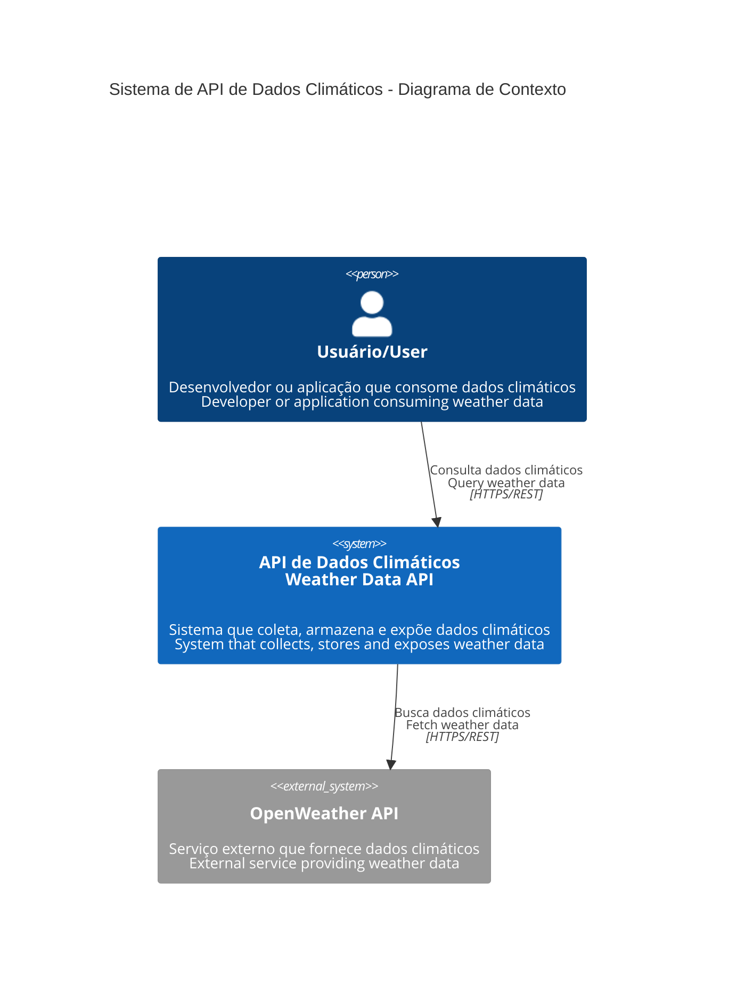
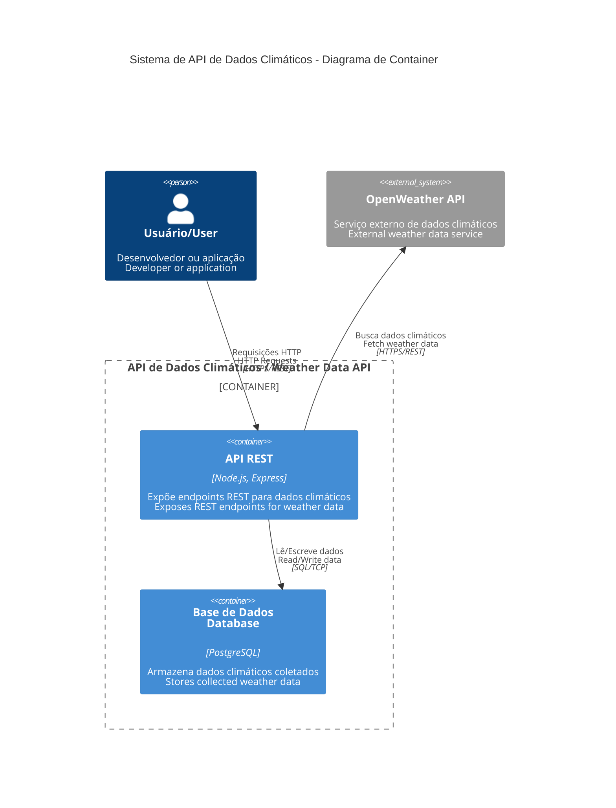

# API de Dados Climáticos / Weather Data API

[](https://github.com/JacksonMiranda/weather-data-api/actions/workflows/ci.yml)
[](https://github.com/JacksonMiranda/weather-data-api/actions/workflows/codeql.yml)
[](https://opensource.org/licenses/MIT)
[](https://github.com/JacksonMiranda/weather-data-api/releases)
[](https://github.com/JacksonMiranda/weather-data-api/issues)
[](https://github.com/JacksonMiranda/weather-data-api/pulls)
[](https://dependabot.com)

## Português (PT-BR)

API RESTful desenvolvida em Node.js com Express que integra com a OpenWeather API para coletar, armazenar e expor dados climáticos através de endpoints próprios. Completamente containerizada com Docker para portabilidade e facilidade de execução.

## English (EN-US)

RESTful API built with Node.js and Express that integrates with OpenWeather API to collect, store and expose weather data through custom endpoints. Fully containerized with Docker for portability and ease of deployment.

---

## 🏗️ Arquitetura / Architecture

### Diagrama de Contexto / Context Diagram



### Diagrama de Container / Container Diagram



## 🛠️ Stack Tecnológica / Tech Stack

### Backend
- **Node.js** - Runtime JavaScript / JavaScript Runtime
- **Express.js** - Framework web / Web Framework  
- **PostgreSQL** - Base de dados relacional / Relational Database
- **Docker** - Containerização / Containerization
- **Docker Compose** - Orquestração de containers / Container Orchestration

### APIs Externas / External APIs
- **OpenWeather API** - Dados climáticos em tempo real / Real-time Weather Data

### Ferramentas de Desenvolvimento / Development Tools
- **Swagger/OpenAPI** - Documentação da API / API Documentation
- **nodemon** - Hot reload durante desenvolvimento / Hot reload for development

## 📋 Pré-requisitos / Prerequisites

### Português (PT-BR)
Antes de começar, garanta que você tenha os seguintes softwares instalados:

- [Docker](https://www.docker.com/get-started)
- [Docker Compose](https://docs.docker.com/compose/install/) (geralmente já vem com o Docker Desktop)
- Uma chave de API válida da [OpenWeather](https://openweathermap.org/appid)

### English (EN-US)
Before you begin, ensure you have the following software installed:

- [Docker](https://www.docker.com/get-started)
- [Docker Compose](https://docs.docker.com/compose/install/) (usually comes with Docker Desktop)
- A valid API key from [OpenWeather](https://openweathermap.org/appid)

## ⚙️ Configuração / Configuration

### Português (PT-BR)

Siga os passos abaixo para configurar e executar o projeto localmente.

**1. Clone o Repositório**
```bash
git clone https://github.com/JacksonMiranda/weather-data-api.git
cd weather-data-api
```

**2. Configure as Variáveis de Ambiente**
Copie o arquivo de exemplo e configure suas variáveis:

```bash
cp .env.example .env
```

Edite o arquivo `.env` e substitua `your_openweather_api_key_here` pela sua chave real da OpenWeather.

### English (EN-US)

Follow the steps below to configure and run the project locally.

**1. Clone the Repository**
```bash
git clone https://github.com/JacksonMiranda/weather-data-api.git
cd weather-data-api
```

**2. Configure Environment Variables**
Copy the example file and configure your variables:

```bash
cp .env.example .env
```

Edit the `.env` file and replace `your_openweather_api_key_here` with your actual OpenWeather API key.

### Arquivo .env.example / .env.example File

```bash
# API Configuration
OPENWEATHER_API_KEY=your_openweather_api_key_here

# Database Configuration  
DB_USER=dev_user
DB_PASSWORD=dev_password
DB_HOST=db
DB_PORT=5432
DB_DATABASE=weather_db

# Application Configuration
PORT=3001
NODE_ENV=development
```

## 🚀 Execução / Running the Application

### Desenvolvimento / Development

```bash
docker-compose up --build
```

### Produção / Production

```bash
docker-compose -f docker-compose.yml up --build -d
```

A API estará disponível em: **http://localhost:3001**  
The API will be available at: **http://localhost:3001**

## 📖 Documentação da API / API Documentation

### Swagger/OpenAPI
Acesse a documentação interativa em: **http://localhost:3001/api-docs**  
Access the interactive documentation at: **http://localhost:3001/api-docs**

### Endpoints Principais / Main Endpoints

#### POST `/weather/{city}`
Busca e armazena dados climáticos de uma cidade  
Fetches and stores weather data for a city

#### GET `/weather`  
Retorna todos os registros de dados climáticos  
Returns all weather data records

#### GET `/health`
Verifica o status da API  
Checks API health status

## 📁 Estrutura de Pastas / Folder Structure

```
weather-data-api/
├── backend/                 # Código-fonte da API / API source code
│   ├── index.js            # Arquivo principal / Main file
│   ├── database.js         # Configuração do banco / Database config
│   └── package.json        # Dependências / Dependencies
├── docs/                   # Documentação / Documentation
│   ├── architecture.md     # Arquitetura do sistema / System architecture
│   └── adr/               # Architecture Decision Records
├── .github/               # GitHub templates e workflows
│   ├── workflows/         # GitHub Actions
│   └── ISSUE_TEMPLATE/    # Issue templates
├── docker-compose.yml     # Orquestração Docker / Docker orchestration
├── Dockerfile            # Imagem Docker / Docker image
├── openapi.yaml          # Especificação OpenAPI / OpenAPI specification
├── .env.example          # Variáveis de ambiente / Environment variables
└── README.md             # Este arquivo / This file
```

## 🧪 Testes e Cobertura / Tests and Coverage

### Executar Testes / Running Tests
```bash
cd backend
npm test
```

### Cobertura / Coverage
```bash
cd backend  
npm run test:coverage
```

## 🗺️ Roadmap

### Em Progresso / In Progress
- [ ] Implementação de cache Redis / Redis cache implementation
- [ ] Autenticação JWT / JWT authentication
- [ ] Rate limiting / Rate limiting
- [ ] Logs estruturados / Structured logging

### Futuro / Future
- [ ] Suporte a múltiplas APIs climáticas / Multiple weather APIs support
- [ ] Interface web / Web interface
- [ ] Notificações em tempo real / Real-time notifications
- [ ] Análise de tendências / Trend analysis

## 🤝 Contribuindo / Contributing

Contribuições são bem-vindas! Por favor, leia o [guia de contribuição](CONTRIBUTING.md) para detalhes sobre nosso código de conduta e o processo para submeter pull requests.

Contributions are welcome! Please read the [contributing guide](CONTRIBUTING.md) for details on our code of conduct and the process for submitting pull requests.

### Como Contribuir / How to Contribute

1. Fork o projeto / Fork the project
2. Crie uma branch para sua feature (`git checkout -b feature/AmazingFeature`)
3. Commit suas mudanças (`git commit -m 'feat: Add some AmazingFeature'`)  
4. Push para a branch (`git push origin feature/AmazingFeature`)
5. Abra um Pull Request / Open a Pull Request

## 📄 Licença / License

Este projeto está licenciado sob a Licença MIT - veja o arquivo [LICENSE](LICENSE) para detalhes.

This project is licensed under the MIT License - see the [LICENSE](LICENSE) file for details.

## 👨‍💻 Autor / Author

**Jackson Miranda**
- GitHub: [@JacksonMiranda](https://github.com/JacksonMiranda)
- Email: jacksonmiranda.dev@gmail.com

## 📞 Suporte / Support

Precisa de ajuda? Veja nosso [guia de suporte](SUPPORT.md) ou abra uma [issue](https://github.com/JacksonMiranda/weather-data-api/issues).

Need help? Check our [support guide](SUPPORT.md) or open an [issue](https://github.com/JacksonMiranda/weather-data-api/issues).

---

⭐ Se este projeto foi útil para você, considere dar uma estrela!  
⭐ If this project was helpful to you, consider giving it a star!
