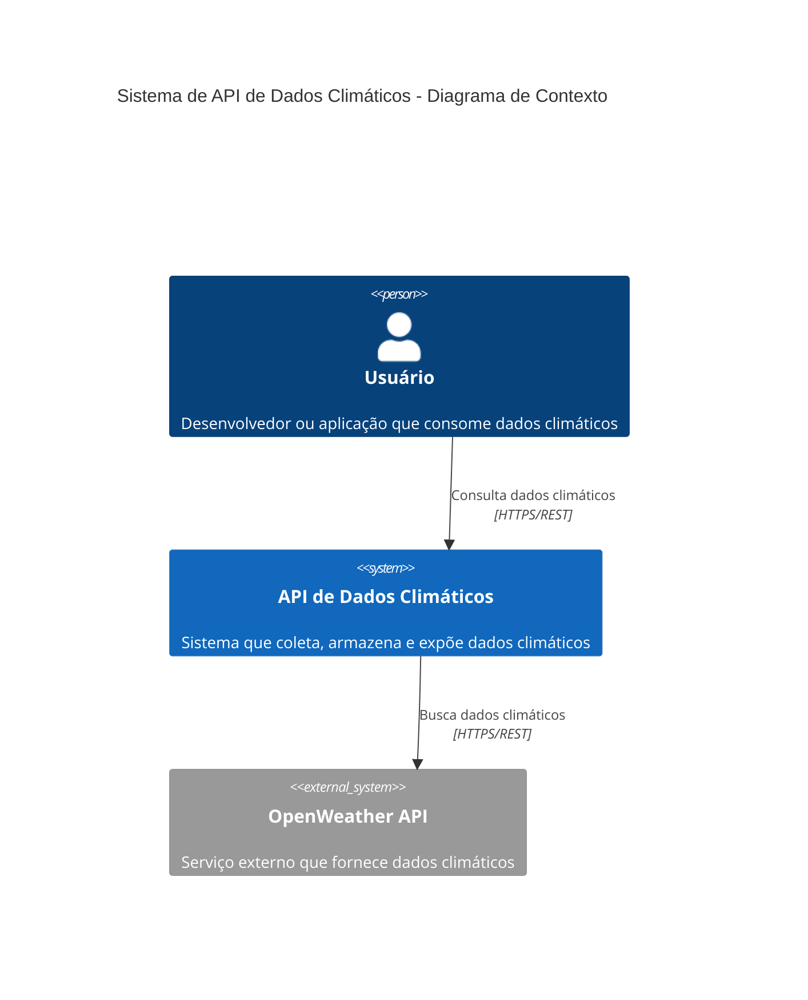
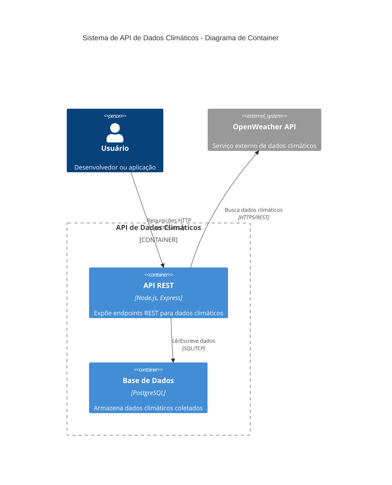

# Arquitetura / Architecture

## Português (PT-BR)

### Visão Geral

Este documento descreve a arquitetura do sistema usando diagramas C4 (Context, Container, Component, Code).

### Diagrama de Contexto C4

### Diagrama de Container C4

---

## English (EN-US)

### Overview

This document describes the system architecture using C4 diagrams (Context, Container, Component, Code).

### C4 Context Diagram

The context diagram above shows the high-level view of the Weather Data API system and its interactions with external entities.

### C4 Container Diagram

The container diagram above shows the high-level technology choices and how responsibilities are distributed across containers.

## Architecture Decision Records (ADRs)

For detailed architectural decisions, see:

- [ADR-0001: Record Architecture Decisions](./adr/0001-record-architecture.md)

## Tecnologias / Technologies

### Backend
- **Node.js**: Runtime JavaScript
- **Express.js**: Framework web
- **PostgreSQL**: Base de dados relacional
- **Docker**: Containerização

### APIs Externas / External APIs
- **OpenWeather API**: Dados climáticos em tempo real

### Ferramentas de Desenvolvimento / Development Tools
- **Docker Compose**: Orquestração de containers
- **Swagger/OpenAPI**: Documentação da API
- **nodemon**: Hot reload durante desenvolvimento